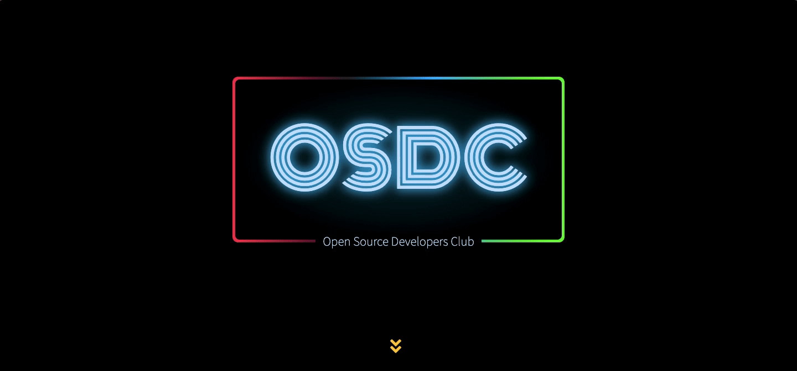

# Open Source Developers Community (OSDC) Official Website

Repository containing the source code of OSDC's website built on [GatsbyJS](http://gatsbyjs.org) and [ReactJS](https://reactjs.org) hosted on [Netlify](app.netlify.com). 

Live at [osdc.netlify.com](https://osdc.netlify.com).🚀

## Setup

- Fork and then clone the repository.
- Install [yarn](https://yarnpkg.com/lang/en/docs/install/#mac-stable)
- Run `yarn` to install the necessary packages.
- Install [`gatsby-cli`](https://www.gatsbyjs.org/tutorial/part-zero/#using-the-gatsby-cli).
- Run `gatsby develop` to run the website in development mode on `localhost:8000`.

## Contribute

- Setup the project on your local machine as mentioned above.
- Feel free to open an issue or recommend any changes which you want to see in the website.
- Make sure one issue recommends one logical change.

## Team

- [@saranshbarua](https://github.com/saranshbarua) - **Saransh Barua**, Maintainer
- [@ryzokuken](https://github.com/ryzokuken) - **Ujjwal Sharma**
